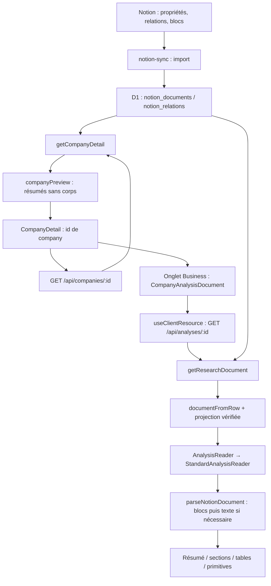

# Investment OS — Lot 0 : baseline

Établie le 30 septembre 2026. Périmètre : rapprochement Sites/GitHub, inspection et mesures. Aucun refactor, nouvelle feature, migration, changement de cache ou déploiement. Priorité visuelle : **mobile first**. Le prompt de chantier et la conversation partagée ont été lus ; deux inventaires factuels ont été délégués à Luna, puis les chemins critiques vérifiés par l'orchestrateur.

## Référence reproductible

| Élément | Référence |
| --- | --- |
| App GitHub | `erwancgn/investment-os` |
| Branche de travail | `chore/architecture-stabilization-mcp` |
| GitHub main au départ | `930442a1520dcc84d74d2601b5d012862a0633bf` — alignement Sites v204 |
| Sites publié | v207, `bf77b919705127e42f880ca6d0785db4feffab85` |
| Baseline réconciliée GitHub | `730d1b291fa064f537f26e9e4ef840822e65fafa` |
| Tag de retour exact | `pre-architecture-stabilization` sur `730d1b2` |
| Arbre Git identique à Sites v207 | `f8c4bab13b63515571ec0512c935021be1d43581` |
| Site | https://investment-os.erwancognee94.chatgpt.site |
| Projet Sites | `appgprj_6a7d7a1233a08191a8d35b746b284e95` |
| Version publiée | `appgprj_6a7d7a1233a08191a8d35b746b284e95~appgver_5e1534e6f1a08191ac21cb00f7b84606` |
| Déploiement existant | `appgdep_6abbef333100819192aa22d3c3bdcd2a`, succeeded, 29/09/2026 17:03:55 UTC |

`git diff 730d1b2 bf77b919705127e42f880ca6d0785db4feffab85 --exit-code` ne retourne aucun écart. Les SHA de commits diffèrent parce que la baseline garde GitHub main comme parent ; les arbres sont identiques. Le tag précède l'ajout de ce document. Un nouveau checkout propre a été créé : l'ancien clone Sites était périmé et contenait des références Git locales invalides, laissées intactes.

GitHub v204 manquait neuf fichiers de la publication v207. Le commit de rapprochement importe exclusivement ce code existant : **372 lignes ajoutées, 149 retirées**, zéro fichier supprimé. Écarts :

| Fichier | Ajouts | Retraits |
| --- | ---: | ---: |
| `app/components/analysis-reader.tsx` | 1 | 1 |
| `app/components/analysis-section-groups.tsx` | 50 | 16 |
| `app/components/investment-memo-reader.tsx` | 3 | 1 |
| `app/components/scenario-comparison.tsx` | 5 | 5 |
| `app/lib/document-presentation.ts` | 2 | 1 |
| `app/lib/inline-format.ts` | 21 | 3 |
| `app/lib/valuation-summary.ts` | 146 | 115 |
| `tests/analysis-inline-format.test.mjs` | 7 | 1 |
| `tests/analysis-reference-fixtures.test.mjs` | 137 | 6 |

Sites reste v207 à la vérification finale. GitHub main et la publication Sites n'ont pas été modifiés. Le repo plugin `erwancgn/plugin-investment-os` n'est pas modifié dans ce lot.

## Runtime et vérifications

Machine de mesure : macOS x86_64, Node **v22.23.1**, npm **10.9.8**. Le repo exige Node >=22.13.0. Versions déclarées : Next 16.3.5, React 19.2.6, vinext 0.0.50, Vite 8.0.13, TypeScript 5.9.3, Wrangler 4.92.0. Production : Worker Cloudflare, D1 `DB`, hébergement Sites.

Les dépendances locales déjà installées du checkout `site-integration` ont été réutilisées ; les deux `package-lock.json` sont identiques (SHA-1 `518848ccb34d66293b0a89e518980f914cb6e935`). Ce n'est pas une preuve d'installation fraîche.

| Vérification | Résultat |
| --- | --- |
| `npm run typecheck` | PASS |
| `npm run build` | FAIL, exit 69 : GNU `timeout` absent de macOS |
| `./node_modules/.bin/vinext build`, subprocess borné à 180 s | PASS, 6,381 s |
| `bash scripts/validate-artifact.sh` | PASS, Worker fetch et manifest d'hébergement empaquetés |
| Liste exacte `node --test` de `package.json` dans le checkout avec espaces | 159/160 PASS |
| Même source taguée, même dist et mêmes dépendances, `/private/tmp/investment-os-baseline-v207` | **160/160 PASS**, 1,533 s |
| `npm run lint` | FAIL : une erreur `prefer-const` et un warning variable inutilisée |

Le test qui échoue uniquement avec les espaces est `analysis sections render H1-only roots and retain Advantest H2/H3 content`, `tests/analysis-reference-fixtures.test.mjs:1042` : un chemin calculé avec `URL.pathname` garde `%20`, qu'esbuild ne résout pas. Le test n'a pas été modifié pour obtenir le PASS. `npm test` complet n'est pas déclaré vert : son wrapper build exige `timeout`. Le build sous-jacent, sa validation et toutes les assertions ont été exécutés séparément.

Lint préexistant : `app/lib/valuation-summary.ts:41`, `found` devrait être `const` ; `app/components/investment-memo-reader.tsx:87`, `index` inutilisé. Warnings build : analyse statique de `/` ne détectant pas l'usage dynamique. Benchmark : SQLite Node expérimental. Les scripts CI utilisent aussi des outils Linux (`flock`, `sha256sum`, `mapfile`, `/proc`) : portabilité macOS à traiter distinctement, sans changer la baseline.

Les 16 fichiers de tests couvrent prompts IA, démo, isolation des scopes, cache, HTML rendu, fixtures récentes/historiques, inline formatting, décisions CIO, projections de présentation, performance D1 synthétique, sécurité Notion, quotes, paniers, warmup, gouvernance/propriété CSS et présence des stories. Plusieurs contrôles sont des assertions de source ou des mocks. Pas de suite e2e navigateur automatisée ni de snapshots visuels automatiques démontrés. Les observations navigateur ci-dessous complètent ces tests sans valider une analyse financière ni une écriture Notion.

## Structure et routes

- `app/page.tsx`, `app/layout.tsx` : shell React et navigation SPA sur `/`.
- `app/components/` : Portfolio, Company, lecteurs d'analyses, Basket, IA, primitives et synchronisation.
- `app/lib/` : data access, snapshot Notion, parsing, présentation, quotes, cache client, navigation.
- `app/data/` : fixtures et registre de templates ; `stories/` : composants de référence.
- `worker/index.ts` : dispatch HTTP, session/scope, auth, Notion et APIs.
- `db/` : schéma/migrations ; `scripts/` : build/installation/validation/audit ; `tests/` et `docs/`.
- `.openai/hosting.json` : projet Sites et binding D1 ; `app/globals.css`, `app/design-system.css`, `app/ux-foundations.css` : styles.

Il n'y a pas de routes Next `app/api` ni de pages Company individuelles. L'URL garde `tab`, `company`, `document` via `app/lib/app-navigation.tsx`. Les endpoints Worker existants sont :

| Lecture | Écriture / opération |
| --- | --- |
| `/api/session` | POST `/api/session` (préférence de scope) |
| `/api/companies`, `/api/companies/:id` | POST `/api/notion/refresh` |
| `/api/analyses/:id` | POST `/api/notion/sync`, `/api/notion/import-next` |
| `/api/portfolio/live`, `/api/quotes`, `/api/theme-baskets` | POST `/api/notion/sync-background`, `/api/notion/sync-portfolio`, `/api/notion/sync-all` |
| `/api/notion/status`, `/api/notion/integrity`, `/api/notion/webhook-verification` | POST `/api/notion/webhook/:secret` |

`/_vinext/image` traite les images. Les chemins API inconnus ont une réponse dédiée. La lecture de données personnelles est autorisée côté Worker par l'identité injectée Sites et `OWNER_EMAIL`, pas par le seul cookie de scope. Les lectures API personnelles sont `private, no-store`. Le mode démo utilise des fixtures séparées.

## Chemin exécuté : Company → Business

1. L'ouverture Company précharge sa ressource ; `CompanyDetail` s'abonne à `useClientResource('/api/companies/:id')`. L'API démo prend une fixture, l'API personnelle appelle `getCompanyDetail`.
2. `getCompanyDetail` (`app/lib/investment-data.ts:394`) lit toutes les Companies, les relations et les corps de toutes les analyses/earnings/decisions/portfolio avant de sélectionner les candidats. Le mapping connaît les noms physiques Notion et les références Current. Les liens explicites et un fallback par nom/titre contribuent à rattacher des documents ; la politique d'archive et le classement statut/date sélectionnent les principales versions.
3. `documentFromRow` reconstruit le texte depuis le snapshot, mappe les propriétés et vérifie la projection. `companyPreview` calcule des résumés, puis retire `plainText` et `notionBlocks` de la réponse Company. L'économie de payload intervient donc après un travail serveur sur les corps.
4. Business monte `CompanyAnalysisDocument`. Si le preview n'a pas de corps, une seconde requête charge `/api/analyses/:id`. `getResearchDocument` (`investment-data.ts:474`) lit le document ciblé, puis les Companies, relations et **tous les corps de recherche** pour propriété/Current/archive. L'ouverture ne fait pas un appel Notion live ; elle utilise le snapshot D1 importé.
5. Le client vérifie l'identité normalisée du document et la présence d'un corps. Sans corps valide : chargement, puis indisponibilité avec relance. Un ancien corps valide peut rester affiché lors d'une erreur de refresh.
6. Business suit `AnalysisReader` → `StandardAnalysisReader`. `parseNotionDocument` privilégie `parseNotionBlocks` si le résultat est exploitable sans markup résiduel ; sinon `parseNotionText` normalise HTML/Markdown/texte. Une projection validée pilote le résumé ; sinon `documentPresentation` extrait le résumé et masque les blocs promus. Valuation ajoute `extractValuationSummary` en absence de projection. Les groupes de sections, tableaux et primitives constituent le corps. Les mémos CIO prennent un chemin distinct `InvestmentMemoReader` : ce n'est pas encore un renderer unique.

Le cache `app/lib/resource-cache.ts` est en mémoire de session : freshness 60 s, promesse partagée par URL, éviction d'entrées inactives à partir de 32 (pas une limite dure pour les entrées actives). Un échec de refresh conserve les données ; 401/403 effacent le cache. Epoch/revision/AbortController protègent les réponses périmées. `notion-sync-complete` invalide les ressources ; retour en ligne/visibilité refreshent les actives. Une requête expirée peut donc relancer Company et Analysis en parallèle. Tous les statuts HTTP non OK hors auth sont aplatis vers « Actualisation indisponible » ; le diagnostic interne de l'erreur d'origine est perdu. L'échec de session conduit au mode démo.

## Mesures de départ

Mesures CDP Chrome sur la publication v207, compte personnel, réseau réel, sans throttling. Ce sont des échantillons uniques, pas des médianes de production. Temps request→response ; Company terminée en 7 287,856 ms. Les tailles indiquées sont `encodedDataLength`, donc pas la taille JSON décompressée.

| Parcours | HTTP | Temps | Octets transférés connus |
| --- | ---: | ---: | ---: |
| Première fiche Advantest | 200 | 7 288 ms | 9 956 |
| Premier Business | 500 | 4 070 ms | non disponible |
| Relance Business | 200 | 7 473 ms | 7 614 |
| Première Valuation | 500 | 7 822 ms | non disponible |
| Refresh Company parallèle à Valuation | 500 | 7 827 ms | non disponible |
| Relance Valuation | 200 | 5 150 ms | trace locale |

Le premier parcours Company→Business compte deux requêtes métier séquentielles, plus chunks JS/favicon et refresh Basket déjà actif. Pas de preuve de duplicata simultané de la même URL dans cette trace. Les retours Business après expiration affichent immédiatement le corps en mémoire **et** lancent Company/Analysis ; les refreshs échouent ensuite. Un retour suivant relance les données restées périmées : il ne démontre pas un retour entièrement sans réseau dans la fenêtre de freshness. Le temps exact click→paint, la normalisation et le rendu ne sont pas instrumentés séparément dans cette baseline ; ces nombres ne doivent pas être déduits des temps réseau. Mesure séparée à établir avant optimisation au Lot 6.

Benchmark existant `tests/benchmark-data.mjs` : D1 SQLite synthétique, 60 companies/180 rapports, 30 itérations après warmup, appels de fonctions, sans HTTP ni renderer navigateur :

| Fonction | Médiane ms | p95 ms | Requêtes SQL | Lignes retournées | JSON octets |
| --- | ---: | ---: | ---: | ---: | ---: |
| Liste analyses | 106,20 | 161,76 | 14 | 544 | 3 924 499 |
| Company complète | 106,36 | 163,18 | 13 | 484 | 66 695 |
| Document | 51,56 | 67,72 | 15 | 545 | 21 977 |
| Portfolio synthétique | 5,31 | 6,37 | 12 | 68 | 1 030 |

Company complète n'est pas le payload preview HTTP ; le Portfolio synthétique est vide et n'est pas représentatif du portefeuille réel. Les anciens rapports `docs/performance-v141.md` concernent une autre révision : aucune comparaison avant/après fiable avec eux.

## Erreurs réelles et warnings

Les logs Sites expliquent la catégorie de défaillance observée : **Worker exceeded memory limit**, outcome `exceededMemory`. Le premier Business échoue le 30/09/2026 à **07:08:21.135 UTC**, request `3e9ff6ee2286275d0981c65638807375`, route `/api/analyses/REDACTED`, wall 3 981 ms, CPU 880 ms. Basket échoue au même moment, request `7e2394600d52ae29364b35aae364f8f0`, wall 1 353 ms, CPU 8 ms. Les logs ultérieurs confirment aussi ce résultat sur Company, Analysis et `/api/portfolio/live` (07:16:22.473 UTC, request `2ab18cc5bb3c333a09420eabe4b63b29`).

La limite mémoire explique ces 500 précis. **L'allocation responsable et la causalité entre requêtes ne sont pas encore prouvées.** La lecture globale de corps dans Company/Document est un candidat à examiner, pas une root cause d'allocation démontrée. La présence d'autres erreurs possibles reste ouverte. `Network.getResponseBody` n'a pas pu récupérer le corps du premier 500 ; les logs Worker donnent la preuve de runtime. Aucun cache, catch ou workaround ajouté.

Autres défauts observés : favicon 404 ; mémo CIO Advantest antérieur au dernier Valuation, signalé dans l'UI ; Basket indique un cours indisponible et des données partielles ; Portfolio conserve ses dernières données lors d'un refresh mémoire échoué. Ces états existent **avant** refactor et devront être distingués des régressions.

## Références visuelles, mobile first

Captures locales privées sous `outputs/baseline/`, ignoré par Git. Aucune donnée personnelle, cookie, header d'authentification ou capture du portefeuille n'est publié dans le repo. Les traces réseau sauvegardées se limitent aux URLs, statuts, timestamps, identifiants de requête et octets ; les logs sont exportés sous forme expurgée. Viewports Chrome **390×844** et contrôles Business/IA **360×800** ; pas un test sur matériel mobile ni une simulation tactile/UA mobile.

| Écran | Fichiers de référence locale |
| --- | --- |
| Portfolio démo / personnel desktop | `demo-portfolio.jpg`, `personal-portfolio.jpg` |
| Company/Business démo desktop | `demo-company.jpg`, `demo-business.jpg` |
| Advantest desktop | `personal-advantest-company.jpg`, `personal-advantest-business-error.jpg` |
| Portfolio mobile | `mobile-portfolio.jpg` |
| Advantest Company mobile | `mobile-advantest-company.jpg` |
| Business mobile, replié et déplié | `mobile-advantest-business-full.jpg`, `mobile-advantest-business-expanded-full.jpg` |
| Business/Valuation mobile indisponibles | `mobile-advantest-business-error.jpg`, `mobile-advantest-valuation-error.jpg` |
| Valuation mobile chargée | `mobile-advantest-valuation-full.jpg` |
| Basket mobile | `mobile-baskets.jpg` |
| IA mobile, sélection Advantest | `mobile-ai.jpg`, `mobile-ai-advantest.jpg`, `mobile-ai-360.jpg` |

Business affiche le rapport validé du 24/09, TL;DR et 10 sections ; l'action Tout déplier/Tout replier est vérifiée. Valuation affiche 17 sections et les scénarios. IA : recherche, sélection et lien de prompt vérifiés, sans envoyer le prompt. Portfolio/Basket/IA et Business replié présentent `scrollWidth === innerWidth` dans les vues mesurées à 390 ; Business et IA aussi à 360. Les onglets Company défilent horizontalement dans leur conteneur. La barre d'édition Sites recouvrait la navigation mobile : masquée pour les dernières captures, sans éditer le site. Les premières captures montrent encore cette barre ; elle est à distinguer de l'UI de l'app. L'override viewport est remis à zéro à la fin.

Pas de validation exhaustive de tables dépliées, accessibilité tactile, autres appareils, plusieurs entreprises réelles ou comparatif pixel par pixel dans ce lot. Ces limites restent dans le panel de validation des lots suivants.

## Bilan et passage au Lot 1

- **Découvertes :** écart v204/v207, chemins de lecture et rendu établis, mémoire Worker dépassée en production, cache mémoire déjà capable de conserver le contenu, plusieurs fallbacks et couplages Notion présents.
- **Modifications :** rapprochement exact du code publié, branche/tag, ce document ; traces/captures locales privées. Zéro modification architecturale.
- **Code supprimé :** zéro nettoyage ; les 149 retraits appartiennent à l'import v207, pas à une réduction de dette réalisée ici.
- **Tests/résultats :** typecheck, build sous-jacent et artefact PASS ; 160/160 assertions dans un chemin sans espaces ; wrappers macOS et lint FAIL préexistants ; parcours réels avec échecs et relances conservés.
- **Dette restante :** cartographie exhaustive KEEP/REFACTOR/DELETE, allocation mémoire responsable, lecteurs/parsers concurrents, fallbacks, cache/erreurs, contrats/Core/adapter et MCP/plugin : non réalisés.
- **Risques :** panne mémoire touche aussi les zones de non-régression ; tests synthétiques ne représentent pas la production ; build CI Linux et test avec espaces peu portables ; référence visuelle réussie nécessaire en complément des erreurs.
- **Usage au point de mesure :** compte Codex : 28 % de la fenêtre 5 h, 4 % hebdomadaire consommés, un reset disponible ; aucun reset utilisé. Ces quotas sont ceux du compte, pas du seul lot.
- **GO recommandé : Lot 1, audit documentaire. NO-GO : refactor ou optimisation avant cartographie et validation du chemin.** Le checkpoint architectural du Lot 2 reste obligatoire avant Lot 3. Ce tour s'arrête au Lot 0 conformément au prompt de démarrage.
