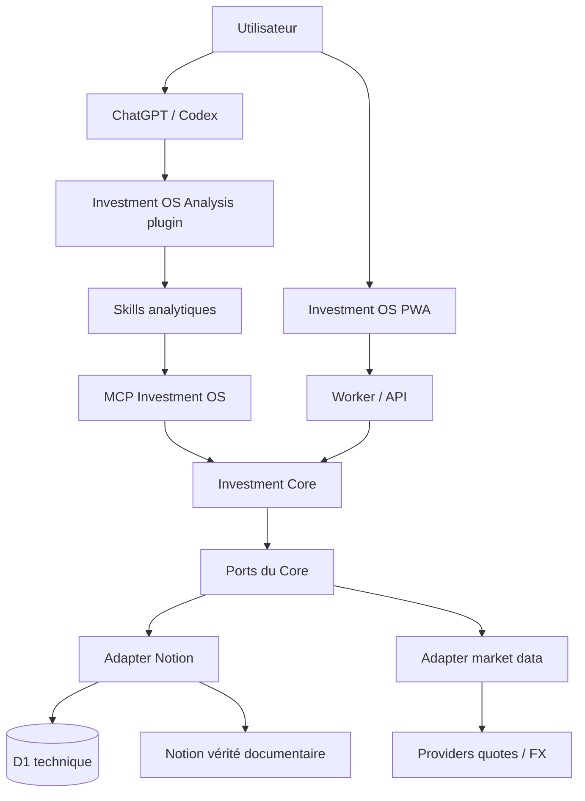

# Investment OS — vision figée OpenAI-first et plan d’exécution Lots 7.2–13

> Statut : décision d’architecture figée le 1 octobre 2026.
>
> Cette note complète `target-architecture.md` et `lot-8-handoff.md`. Elle ne remplace ni les contrats du domaine, ni les gates de chaque lot. En cas de conflit sur l’état courant, la passation du lot en cours prévaut. En cas de conflit sur la vision cible des lots 8–13, cette note prévaut jusqu’à décision utilisateur explicite contraire.

## 1. Décision produit et principe directeur

Investment OS est **OpenAI-first en exploitation**, parce que l’usage réel prévu reste principalement dans l’écosystème OpenAI :

- ChatGPT et Codex pour l’usage agentique ;
- le plugin `Investment OS Analysis` pour regrouper Skills et outils ;
- les Skills pour la méthodologie financière ;
- ChatGPT Sites pour l’application actuelle et, si les gates du Lot 11 le valident, comme première cible d’hébergement du serveur MCP ;
- MCP comme transport standard entre les agents et Investment OS.

Cette préférence d’exploitation ne doit pas devenir un verrou d’architecture.

Le principe à préserver est :

> **OpenAI-first, pas OpenAI-locked.**
>
> Sortir d’OpenAI ultérieurement doit principalement remplacer le runtime, le transport ou l’intégration agentique. Cela ne doit pas imposer de réécrire les règles métier, les contrats, le modèle canonique, les calculs ou les adapters de données.

Conséquence : le Core et les contrats ne doivent dépendre ni de ChatGPT, ni de Sites, ni du SDK OpenAI, ni de MCP. Le MCP est un transport. Les Skills sont une couche de méthodologie. La PWA est une interface. Notion/D1 sont une implémentation de persistence/cache actuelle.

## 2. Ce qui est vrai aujourd’hui

### 2.1 Production réellement déployée

La production reste **Sites v208**, issue du Lot 6 :

- source Lot 6 : `9f98a7f7a20adef95c591a583fe60a70e04a8e38` ;
- le Lot 7 n’est pas déployé ;
- Notion reste la vérité documentaire ;
- D1 reste le snapshot/cache technique et la file technique ;
- le Worker Sites sert les routes HTTP, auth, sync et composition ;
- la PWA React/Vinext consomme ces routes.

Le runtime de production ne contient donc pas encore la cible Core complète du chantier et ne contient pas de serveur MCP Investment OS.

### 2.2 Branche d’architecture

Branche canonique du refactor :

`chore/architecture-stabilization-mcp`

Checkpoint produit du Lot 7 :

`0d8853eced6d28e5bd861916c92ac9da16c5499b`

Checkpoint documentaire de consolidation Lot 7.1 :

`4347182e17d7a72a54f84662f37ed9be9d3234dd`

Le Lot 7 a introduit :

- `core/contracts/` ;
- `core/analysis/current-selection.ts` ;
- `core/portfolio.ts` ;
- `core/services/investment-os.ts` ;
- `core/services/ports.ts` ;
- `adapters/notion/investment-reads.ts` ;
- des migrations de consommateurs de lecture ;
- les tests Core/adapters associés.

### 2.3 Ce qui est déjà réellement branché sur la branche du chantier

Le Core fournit les opérations suivantes :

- `getCompany()` ;
- `getPortfolio()` ;
- `getPosition()` ;
- `getCurrentAnalysis()` ;
- `listAnalyses()` ;
- `saveAnalysis()` ;
- `getQuote()` ;
- `getAnalysisById()`.

État runtime :

| Opération | État |
| --- | --- |
| `getCompany` | pont Core actif pour le détail Company personnel, transport historique préservé |
| `getPortfolio` | pont Core actif sur le Portfolio personnel |
| `getAnalysisById` | pont Core actif ; archives et historiques restent adressables |
| `getQuote` | pont Core actif via le batch de quotes existant |
| `listAnalyses` | utilisé pour l’intégrité dans le mode prévu |
| `getCurrentAnalysis` | implémenté et testé, mais **pas encore basculé comme politique Current unique du runtime/UI** |
| `getPosition` | contrat/service présent, pas d’adapter runtime réel final |
| `saveAnalysis` | contrat/service présent, aucun writer Notion réel final ; une sync D1 n’est pas une sauvegarde métier |

Le Core n’est donc pas « terminé » au sens migration. Il est suffisamment matérialisé pour tester ses frontières, mais son adoption finale dépend des gates du Lot 7.2 et du Lot 8.

## 3. Où vivent les responsabilités dans la cible

### 3.1 Investment Core

Le Core porte les règles métier et les politiques de domaine :

- identité et validation canonique ;
- politique Current/archive ;
- agrégats Portfolio ;
- contracts de Company/Analysis/Position/Portfolio/Quote ;
- orchestration des opérations métier ;
- erreurs et diagnostics de domaine ;
- validation des receipts d’écriture.

Le Core ne doit pas connaître :

- les noms de propriétés Notion ;
- D1 ;
- HTTP ;
- cookies/auth Sites ;
- React ;
- ChatGPT ;
- MCP ;
- le SDK OpenAI ;
- les prompts ou méthodes financières des Skills.

### 3.2 Adapter Notion

L’adapter Notion porte la traduction entre la persistence actuelle et les contrats du Core :

- IDs Notion ;
- propriétés physiques ;
- relations ;
- alias de propriétés ;
- statuts ;
- dates ;
- extraction des pointeurs Current ;
- lecture/sync des snapshots D1 lorsque D1 est la projection locale de Notion ;
- écriture métier Notion au Lot 8 ;
- reprise, retry, idempotence et vérification des écritures.

Le Core reçoit des valeurs déjà normalisées.

### 3.3 D1

D1 reste un composant technique :

- snapshots ;
- cache ;
- index ;
- files de jobs/import ;
- verrous ;
- événements webhook ;
- données de quotes mises en cache.

D1 n’est pas la vérité documentaire et ne doit pas devenir une seconde logique métier.

### 3.4 PWA / UI

La PWA reste l’application utilisateur Investment OS :

- Portfolio ;
- Exposition ;
- Trajectoire ;
- Companies ;
- Company detail ;
- analyses ;
- Basket ;
- AI ;
- Gestion ;
- démo/personnel.

Elle consomme des routes Worker/API et des résultats du Core. Elle ne doit plus décider elle-même quelle analyse est Current, remapper Notion ou réimplémenter les calculs Core.

### 3.5 Skills

Les Skills du plugin `Investment OS Analysis` portent l’intelligence analytique et la méthodologie :

- business-analyst ;
- fair-value ;
- short-seller ;
- portfolio-fit ;
- investment-memo-cio ;
- full-value ;
- full-analyse ;
- autres workflows explicitement maintenus par le plugin.

Ils décident **comment analyser** une entreprise. Ils ne doivent pas contenir la politique de stockage, le mapping Notion ou une copie de la politique Current.

### 3.6 MCP

Le MCP expose les capacités Investment OS aux agents.

Il doit rester une couche mince :

```text
ChatGPT / Codex
      |
      v
Plugin + Skills
      |
      v
MCP transport
      |
      v
Investment Core
      |
      v
ports/adapters
```

Le MCP ne doit pas décider :

- quelle analyse est Current ;
- comment déterminer un owner ;
- comment reconnaître une archive ;
- comment calculer un portefeuille ;
- comment sélectionner une version ;
- comment interpréter les propriétés physiques Notion.

Il valide l’entrée transport, appelle le Core et traduit le résultat du Core vers le protocole MCP.

## 4. Architecture cible figée



Le diagramme est logique, pas une obligation de processus séparés. Au Lot 11, le MCP peut vivre dans le même runtime Sites que l’application si l’isolation, les permissions et les contraintes runtime sont validées. Un second Site technique n’est créé que si une contrainte démontrée le justifie.

## 5. Portabilité : ce qui doit pouvoir sortir d’OpenAI

Doivent rester portables :

- `core/contracts/*` ;
- services Core ;
- sélection Current ;
- calculs Portfolio ;
- modèle canonique ;
- contrats MCP en tant que schémas, sans dépendance runtime Sites ;
- adapters de données ;
- tests de domaine ;
- normalisation et règles de mapping qui ne sont pas spécifiques au runtime OpenAI.

Sont explicitement autorisés à être OpenAI-spécifiques :

- publication Sites ;
- auth/audience Sites ;
- configuration de plugin ;
- packaging du plugin ;
- intégration du MCP hébergé par Sites ;
- expérience ChatGPT/Codex ;
- permissions OpenAI de plugin/Site.

La sortie future d’OpenAI n’est **pas** un lot du chantier actuel. Elle est seulement rendue praticable par les frontières ci-dessus.

## 6. Roadmap globale figée

| Lot | Objet | État au 01/10/2026 | Gate |
| --- | --- | --- | --- |
| 0 | Baseline | terminé | état restaurable et preuves baseline |
| 1 | Debt map | terminé | dette et doublons factuels |
| 2 | Architecture cible | terminé | frontières et dépendances |
| 3 | Contrats domaine | terminé | contrats et selector pur |
| 3.5 | Reproductibilité Codex Cloud | terminé | environnement documenté |
| 4 / 4.1 | Renderer canonique | terminé | rendu partagé, corrections ciblées |
| 5 | Nettoyage | terminé | code remplacé retiré avec preuves |
| 6 | Performance / lectures ciblées | terminé et déployé | recette production v208 |
| 7 | Core | implémenté, **gate final ouvert** | parité réelle Current |
| 8 | Adapter Notion lecture/écriture | NO-GO avant clôture Lot 7 | mapping complet + writer vérifié |
| 9 | Skill permanent | futur | chemin stabilisé et règles anti-duplication |
| 10 | Contrat MCP | futur | schémas/auth/version/scope runtime-agnostic |
| 11 | Serveur MCP | futur | serveur mince sur Core, runtime validé |
| 12 | Migration plugin → MCP | futur | parité méthodologique, receipts et persistence |
| 13 | Clôture | futur | non-régression globale, sécurité, perf, docs |

## 7. Lot 7.2 — mission immédiate

Le Lot 7.2 est le seul travail autorisé avant le Lot 8, sauf documentation explicitement demandée.

Objectif : démontrer que la politique `getCurrentAnalysis()` du Core peut remplacer la politique legacy sans masquer d’écart inexpliqué.

Résultats Lot 7.1 déjà acquis :

- Cadence Business : même sélection legacy/Core ;
- Advantest Business : même sélection ;
- Advantest Valuation : même sélection ;
- KLA Business/Valuation : legacy fallback vers v2 ; pointeur réel vers v1 Superseded ; classification `DATA_INCONSISTENCY` + `EXPECTED_POLICY_CHANGE` ; aucun `CORE_BUG`.

Preuves encore requises :

- index/relations D1 nécessaires à la sélection ;
- conflits d’owner éventuels ;
- branches du graphe réel non encore suffisamment couvertes ;
- complément many-to-many/fallback/dates uniquement si les preuves existantes restent insuffisantes.

Chaque divergence doit être classée :

- `CORE_BUG` ;
- `MAPPING_BUG` si un mapping d’adapter est réellement en cause ;
- `LEGACY_BUG` ;
- `DATA_INCONSISTENCY` ;
- `EXPECTED_POLICY_CHANGE`.

Ne pas modifier le Core pour reproduire une anomalie legacy ou une incohérence de données. Un correctif Core exige un `CORE_BUG` démontré.

Gate Lot 7 :

- toutes les divergences significatives expliquées ;
- aucune branche critique du graphe Current non couverte ;
- aucune donnée personnelle/export brut ajouté à Git ;
- verdict GO/NO-GO explicite ;
- passation mise à jour avant tout début du Lot 8.

## 8. Lot 8 — Adapter Notion complet

### Objectif

Faire de Notion une dépendance remplaçable derrière les ports du Core, tout en conservant Notion comme vérité documentaire pendant ce chantier.

### Lecture

Déplacer/centraliser dans l’adapter tout ce qui connaît :

- noms de propriétés Notion ;
- relations ;
- alias ;
- UUID physiques ;
- classification des familles ;
- statuts/fraîcheur ;
- dates ;
- pointeurs Current ;
- mapping snapshots D1.

Ne pas créer un second parser ou une seconde politique Current.

### getPosition

Livrer un vrai adapter runtime :

- lookup par ID stable ;
- position ouverte ou fermée ;
- ne pas déduire l’historique complet du seul portefeuille live ;
- mêmes règles de calcul et provenance que le domaine ;
- tests de position absente, fermée, ouverte et incohérente.

### saveAnalysis

Le writer doit être une vraie opération métier, pas un alias de sync.

Contrat minimal à garantir :

- `runId` idempotent ;
- `expectedRevision` / contrôle de concurrence ;
- validation de la Company et des relations ;
- écriture du document ;
- promotion Current lorsque demandée ;
- relecture après écriture ;
- vérification que la cible persistée correspond au résultat attendu ;
- retries sûrs ;
- distinction d’un succès partiel ;
- diagnostic exploitable sans exposer de secret.

Le receipt du Core doit rester capable de distinguer :

- `persisted` ;
- `promotion_pending` ;
- `verified` ;
- `partial`.

Les détails exacts du mécanisme Notion (CAS natif ou séquence réconciliable) appartiennent à l’adapter. Ne jamais faire promettre au Core une atomicité que Notion ne garantit pas réellement.

### Gate Lot 8

- mappings physiques isolés ;
- lecture réelle par les ports ;
- `getPosition` réel ;
- `saveAnalysis` réel ;
- idempotence/retry/concurrence testés ;
- receipts prouvés ;
- auth/secrets inchangés ou améliorés ;
- aucune mutation navigateur non autorisée ;
- aucune régression PWA/Portfolio/Basket/analyses.

## 9. Lot 9 — Skill permanent

Le Lot 9 n’est pas une réécriture méthodologique.

Objectifs :

- documenter le chemin stabilisé entre Skills, MCP, Core et adapters ;
- figer les responsabilités ;
- empêcher le retour de logique dupliquée ;
- conserver Investment OS Analysis comme source canonique de la méthodologie financière.

Interdits :

- politique Current dans un Skill ;
- mapping Notion dans un Skill ;
- calcul Portfolio dupliqué dans un Skill ;
- nouvelle méthode financière dans le Core ;
- logique d’hébergement OpenAI dans les Skills ;
- modification du contenu/méthode des Skills au motif de la migration MCP.

Livrable attendu : instructions permanentes/skill de développement ou documentation équivalente qui force les prochains changements à respecter le chemin canonique.

Source permanente de développement : `AGENTS.md`, sections « Architecture permanente et propriétaires canoniques » et « Secrets ». Compléter cette source plutôt que créer une seconde couche d’instructions. État de clôture et passation Lot 10 : `docs/architecture/lot-9-handoff.md`.

## 10. Lot 10 — contrat MCP

### Rôle

Définir le langage stable entre Investment OS et les agents avant de choisir les détails d’hébergement.

### Principe

Le contrat MCP est **runtime-agnostic**. Le même contrat doit pouvoir être servi depuis Sites ou un runtime indépendant.

### Surface initiale

La surface exacte est décidée au Lot 10 à partir des consommateurs réels. Point de départ :

- `get_company` ;
- `get_portfolio` ;
- `get_position` ;
- `get_current_analysis` ;
- `list_analyses` ;
- `save_analysis` ;
- `get_quote`.

L’accès historique par ID peut être exposé si un workflow réel le justifie ; le fait que `getAnalysisById` existe dans le Core ne force pas automatiquement un huitième tool public.

### Chaque tool doit spécifier

- nom stable ;
- description ;
- version de contrat ;
- schéma d’entrée ;
- schéma de sortie ;
- mapping exact vers une opération Core ;
- erreurs et diagnostics ;
- READ ou WRITE ;
- scope personnel/démo le cas échéant ;
- auth requise ;
- règles d’idempotence ;
- comportement en cas de stale data ;
- limites de pagination/taille ;
- politique de timeout/retry du transport.

### Interdits

Le contrat MCP ne doit pas exposer :

- noms de colonnes/propriétés Notion ;
- tables D1 ;
- détails d’implémentation Worker ;
- erreurs DB brutes ;
- secrets ;
- objets React/UI ;
- règles financières propres aux Skills.

### Gate Lot 10

- schemas versionnés ;
- tests contractuels ;
- erreur/scope/auth documentés ;
- READ/WRITE séparés ;
- aucune logique métier créée dans le transport ;
- décision claire sur la surface minimale.

## 11. Lot 11 — serveur MCP et runtime

### Cible d’exploitation

Première cible : **ChatGPT Sites**, parce que l’utilisation réelle reste OpenAI-first.

OpenAI documente qu’un serveur MCP peut être ajouté à un **Site nouveau ou existant**, puis utilisé via un plugin. La publication/republication du Site crée ou actualise le plugin associé. Les permissions Site, plugin et services connectés restent distinctes.

Références officielles à revalider au début du Lot 11 car le produit peut évoluer :

- https://help.openai.com/en/articles/20001339-creating-and-using-chatgpt-sites
- https://help.openai.com/en/articles/20001547-hosting-a-plugin-with-chatgpt-sites
- https://help.openai.com/en/articles/20001256-plugins-in-chatgpt-and-codex

### Décision « un Site ou deux Sites »

Ne pas créer deux Sites par principe.

Ordre de décision :

1. tenter de placer le MCP dans le Site Investment OS existant si le runtime permet une séparation claire des secrets, permissions et déploiements ;
2. mesurer impact build/runtime/mémoire et surface d’exposition ;
3. vérifier audience personnelle/démo et permissions plugin ;
4. créer un Site technique séparé seulement si une contrainte réelle de sécurité, de cycle de déploiement, d’audience ou de runtime le justifie.

Le choix un Site/deux Sites est donc **un détail de déploiement du Lot 11**, pas une frontière du domaine.

### Implémentation

Le serveur MCP doit ressembler conceptuellement à :

```text
validate MCP request
        |
        v
map to Core input
        |
        v
call Investment Core
        |
        v
map ServiceResult
        |
        v
MCP response
```

Il ne doit pas introduire de cache métier, de fallback Current ou de logique Notion.

### Sécurité

À valider explicitement :

- auth du caller ;
- audience Site ;
- accès plugin séparé ;
- scopes READ/WRITE ;
- confirmation des actions mutantes si la plateforme l’exige ;
- aucun secret envoyé au client ;
- séparation demo/personnel ;
- logs sans contenu privé ;
- rate limits et timeouts ;
- idempotence des writes via `runId`.

### Gate Lot 11

- outils MCP exécutables contre Core ;
- erreurs typées ;
- scopes et permissions testés ;
- READ validé avant WRITE ;
- aucun appel direct Notion depuis le transport si un port Core existe ;
- choix Site existant vs Site dédié justifié par mesure/contrainte ;
- possibilité de déplacer le serveur MCP vers un autre runtime sans modifier le Core.

## 12. Lot 12 — migration du plugin Investment OS Analysis vers MCP

### Objectif

Remplacer l’infrastructure d’accès aux données/persistance par les tools MCP, **sans changer la méthodologie des Skills**.

Exemple cible :

```text
/full-value NVDA
       |
       v
full-value skill
       |
       +--> MCP get_company
       +--> MCP get_portfolio
       +--> MCP get_current_analysis
       |
       v
Business / Valuation / CIO selon le workflow canonique
       |
       v
MCP save_analysis
       |
       v
Core -> Adapter Notion -> Notion
```

### Source canonique des Skills

Le repo/plugin actuel `erwancgn/plugin-investment-os` reste la source de la méthodologie et des workflows tant qu’une décision explicite ne le remplace pas. Le chantier MCP ne doit pas réinterpréter ou simplifier ses méthodes.

### Parité obligatoire

Comparer avant/après MCP :

- inputs réellement fournis aux Skills ;
- ordre des workflows/handoffs ;
- contenu attendu ;
- scores/verdicts lorsque le skill en définit ;
- receipts ;
- relations ;
- promotion Current ;
- persistence finale ;
- gestion des erreurs partielles.

Une divergence méthodologique n’est pas un « détail de migration ».

### Gate Lot 12

- Skills inchangés sauf adaptation infrastructure nécessaire ;
- plugin utilise les tools MCP officiels ;
- parité des outputs démontrée sur un panel représentatif ;
- writes et receipts vérifiés ;
- aucun accès direct Notion résiduel dans le plugin s’il est remplacé par MCP ;
- permissions plugin/Site vérifiées séparément.

## 13. Lot 13 — validation finale et clôture

Le chantier n’est clos qu’après une campagne complète.

### Produit

- Portfolio ;
- Exposition ;
- Trajectoire ;
- Companies ;
- Company ;
- analyses ;
- historique ;
- Basket ;
- AI ;
- Gestion ;
- espace demo/personnel.

### Renderer

- Business ;
- Valuation ;
- Short ;
- Portfolio Fit ;
- Earnings ;
- CIO Memo ;
- Decision ;
- Generic ;
- projection valide/absente/invalide ;
- historique HTML/Markdown ;
- blocs Notion structurés ;
- sources/citations ;
- scénarios/seuils.

### Mobile

Viewports minimum :

- 360×800 ;
- 390×844.

Vérifier navigation, disclosures, largeur, tableaux, KPI, Decision Card et absence de débordement.

### Performance

Reprendre des mesures comparables :

- cold/warm ;
- fanout ;
- SQL/reads ;
- taille payload ;
- mémoire ;
- normalisation ;
- SSR ;
- MCP read/write ;
- absence de lecture de tous les corps pour une opération ciblée.

### Sécurité

- auth Sites ;
- owner/demo ;
- routes privées ;
- secrets ;
- webhook ;
- MCP permissions ;
- plugin access ;
- WRITE ;
- idempotence ;
- erreurs sans fuite de données.

### Nettoyage

Retirer seulement les wrappers/bridges legacy dont tous les consommateurs ont été migrés. Chaque suppression exige une recherche de références et des tests. Aucun nettoyage général opportuniste.

### Documentation

Mettre à jour :

- README ;
- architecture ;
- contrat de domaine ;
- passations ;
- schéma runtime réel ;
- procédure de rollback ;
- dépendances OpenAI réelles ;
- surface MCP finale.

Le chantier est clos seulement lorsque la documentation décrit le système **effectivement exécuté**, pas la cible prévue.

## 14. Ce qui est hors scope de ce chantier

Ne pas intégrer avant clôture du Lot 13, sauf décision utilisateur explicite :

- migration Notion → Supabase ;
- Supabase Auth ;
- RLS ;
- multi-user complet ;
- lancement public ;
- migration Vercel/Cloudflare/autre runtime ;
- multi-LLM réel ;
- Claude/Gemini comme providers de production ;
- réécriture from scratch ;
- nouvelle méthode de valorisation/analyse ;
- refonte visuelle non requise par un gate.

Ces sujets constituent le chantier suivant. Le refactor courant doit seulement rendre ces migrations moins coûteuses.

## 15. Scénario de sortie future d’OpenAI

La portabilité sera considérée réussie si une future migration peut conserver :

```text
core/
contracts/
analysis policies/
portfolio calculations/
notion or supabase adapters/
MCP schemas/
domain tests/
```

et remplacer principalement :

```text
ChatGPT Sites runtime
Plugin packaging
OpenAI auth/permissions
OpenAI-specific deployment
```

Exemple futur non planifié :

```text
aujourd'hui:
ChatGPT/Codex -> Plugin -> MCP on Sites -> Core

demain éventuellement:
autre agent/runtime -> même contrat MCP -> Core
```

Aucune implémentation de ce scénario n’est demandée dans les Lots 7–13.

## 16. Règles de reprise pour Codex

À chaque nouvelle fenêtre :

1. vérifier le repo exact et la branche `chore/architecture-stabilization-mcp` ;
2. vérifier HEAD et `git status` ;
3. lire `AGENTS.md` ;
4. lire la passation du lot courant ;
5. lire cette vision figée ;
6. lire seulement les fichiers/contrats du périmètre nécessaire ;
7. ne pas recommencer un lot déjà validé ;
8. ne pas anticiper le lot suivant avant le gate ;
9. ne pas modifier du code sans cause démontrée ;
10. produire un checkpoint et une passation à chaque gate.

### Ordre de lecture recommandé à la reprise actuelle

1. `AGENTS.md`
2. `docs/architecture/lot-8-handoff.md`
3. `docs/architecture/openai-first-execution-plan.md`
4. `docs/architecture/target-architecture.md`
5. `docs/architecture/domain-contracts.md`
6. `core/services/investment-os.ts`
7. `core/services/ports.ts`
8. `core/analysis/current-selection.ts`
9. `adapters/notion/investment-reads.ts`
10. tests concernés.

## 17. Résumé décisionnel

Le chantier initial reste valide.

Le changement de vision produit n’ajoute pas un nouveau lot et ne réouvre pas les Lots 0–9. Il précise seulement :

- **Lot 10** : contrat MCP portable/runtime-agnostic ;
- **Lot 11** : serveur MCP mince, Sites comme première cible d’hébergement, Site existant préféré si compatible ;
- **Lot 12** : migration infrastructure du plugin vers MCP, sans changement de méthodologie.

La priorité immédiate ne change pas : **finir le Lot 7.2 et son parity gate avant tout Lot 8 ou MCP**.
