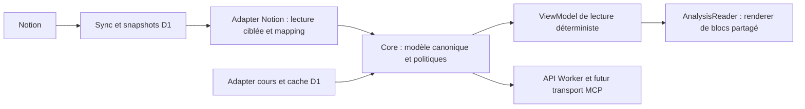

# Investment OS — Lot 2 : architecture cible

Décision de conception du 30 septembre 2026, fondée sur la [baseline Sites v207](baseline.md) et la [debt map](debt-map.md), commit d'audit `ae8d566`. **Au checkpoint du Lot 2, aucune de ces extractions n'était encore implémentée.** Les contrats du Lot 3 sont depuis matérialisés dans les [contrats de domaine](domain-contracts.md); les migrations d’adapters, services et consommateurs restent à faire. La branche reste `chore/architecture-stabilization-mcp`, sans changement ni déploiement de l'application.

Trois revues factuelles Luna ont couvert données/cache, renderer/mobile/tests et contrats/Core/MCP. L'orchestrateur a relu les conclusions, choisi les frontières et effectué la revue finale. Les notes de travail restent locales dans `outputs/lot1/` et `outputs/lot2/` ; les décisions revues sont celles de ce document.

La préparation de la preuve de reproductibilité Codex Cloud avant le Lot 4 est suivie dans le [Lot 3.5 — préparation Codex Cloud](codex-cloud-environment.md).

## Décisions et limites

Notion demeure la source des documents, propriétés métier, relations et pointeurs Current. D1 conserve les snapshots synchronisés, index, jobs, verrous et caches techniques déjà utilisés. Le Worker Sites reste la frontière HTTP, d'authentification et de composition. React reste la présentation mobile first. Les analyses continuent d'être produites par les workflows existants ; le Core ne produit aucun jugement financier avec un LLM.

On extrait progressivement les responsabilités existantes : contrats de domaine versionnés, mapping physique Notion, politique Current/archive, normalisation documentaire et rendu de blocs commun. On conserve Portfolio, Basket, IA, sécurité et navigation comme consommateurs de référence. Aucun nouveau framework, seconde bibliothèque UI, migration Supabase, multiutilisateur, Dots, sortie de Sites ou refonte visuelle n'entre dans ce chantier.

## Chemin canonique et dépendances

Le diagramme montre le flux des valeurs ; les dépendances du code suivent les ports du Core. Le Core ne dépend ni de React, ni des noms de propriétés Notion, ni de D1, ni de Sites, ni du transport MCP. Les adapters implémentent ses ports. Le Worker assemble les implémentations et applique les gardes avant chaque appel. La vue dépend des contrats ; elle ne choisit plus le rapport Current ni ne remappe les propriétés physiques.

Organisation cible minimale, à matérialiser uniquement dans les lots concernés :

| Emplacement | Responsabilité | Origine à réutiliser |
| --- | --- | --- |
| `core/contracts/` | Types, versions et validation des entrées/sorties publiques du domaine | Types aujourd'hui dans `investment-data.ts`, contrat de projection existant |
| `core/analysis/` | Normalisation pure du contenu portable, sélection Current/archive, règles documentaires | `document-presentation`, `valuation-summary`, politique dispersée |
| `core/` | Services métier et ports nécessaires aux opérations effectivement consommées | Services de `investment-data.ts`, calculs Portfolio conservés |
| `adapters/notion/` | Source IDs/propriétés/relations ; implémentations distinctes des ports de lecture snapshot D1, de sync et d'écriture API Notion | `notion-sync.ts`, mapping de `investment-data.ts`, lecteur des blocs Notion |
| `adapters/market-data/` | Fournisseurs, validation, cache cours/FX/historique | `live-quotes.ts`, logique de quotes/Basket existante |
| `app/lib/` | ViewModel et cache de ressources de la session UI | Helpers de présentation et `resource-cache.ts` |
| `app/components/` | Compositions existantes et unique rendu des blocs | `AnalysisReader`, primitives, sections, table, scénarios, composition CIO |
| `worker/` | HTTP, auth, secrets, composition et diagnostics | Routes et gardes actuelles |
| Transport MCP, emplacement au Lot 11 | Adaptation des sept opérations sans logique métier | Aucun serveur MCP applicatif déployé actuellement |

Il n'y a pas de monorepo, de conteneur d'injection ou de repository générique à ajouter. Chaque extraction migre les consommateurs du module existant ; un wrapper temporaire a un consommateur identifié et une condition de retrait. Les corps de lecteurs remplacés sont retirés au Lot 4 ; le nettoyage transversal reste au Lot 5.

## Contrats à figer au Lot 3

Les noms ci-dessous définissent les responsabilités. Les contrats versionnés et fixtures matérialisés au Lot 3 sont documentés dans les [contrats de domaine](domain-contracts.md); la politique Current y reste pure et non branchée aux adapters/consommateurs.

| Contrat | Invariants |
| --- | --- |
| `Company` / `CompanyPreview` | Identité stable, ownership/watchlist, métadonnées et références d'analyses ; aucun corps documentaire dans le preview |
| `AnalysisHeader` | ID, famille explicite, statut, dates, company IDs, provenance et révision ; classification physique effectuée dans l'adapter |
| `AnalysisDocument` | Header, contenu canonique, résumé/faits attestés, projection et diagnostics ; distinct du preview |
| `AnalysisContent` | Blocs ordonnés, IDs de source stables, texte et annotations sûres, sections, tables, listes et contenu non pris en charge conservé |
| `Decision` / `EarningsReview` | Champs métier actuels et états explicites ; la décision Notion et le memo CIO ont des compositions distinctes |
| `Portfolio` / `Position` | Quantités, PRU, comptes, objectifs, expositions, rapprochement et calculs actuels ; provenance et couverture des cours |
| `Quote` | Valeur, devise, source, date du cours, date de récupération et fraîcheur distinctes ; zéro ne remplace jamais une donnée absente |
| Résultat de service | Donnée valide, métadonnées de fraîcheur/révision et diagnostics ; erreur typée quand l'opération ne peut fournir de résultat valide |

La version de domaine proposée est `schemaVersion: "1.0.0"`. Elle est indépendante de `presentationContractVersion: "1.0.0"`, de la version méthodologique actuelle `contractVersion: "1.2.6"`, de `pluginVersion` et de la version de normalisation. On réutilise le validateur strict de `presentation-projection.ts` pour cette projection ; les entités et résultats du domaine ont leur propre validation de contrat au Lot 3. On ne crée pas un validateur concurrent de la projection. Les valeurs `known`/`unknown`, unités, dates et preuves survivent au passage dans le domaine. Une famille non reconnue reste explicite et lisible ; elle n'est pas transformée en Business par une heuristique UI.

Une incompatibilité de version est diagnostiquée avant publication du résultat. Les anciennes analyses entrent par les lecteurs de format de compatibilité documentés ; cette compatibilité ne signifie pas accepter un payload structuré invalide. Les dates/horloges nécessaires à une normalisation sont injectées, afin que la même entrée, version et date de référence produisent la même sortie.

## Normalisation et rendu

**Un seul pipeline de normalisation, deux lecteurs de format nécessaires.** Le lecteur Notion structuré est dans l'adapter ; le lecteur HTML/Markdown historique produit les mêmes blocs portables. Le dispatcher existant `parseNotionDocument` est déplacé/refactoré, pas doublé. Les propriétés physiques Notion restent dans l'adapter ; la présentation métier portable reste dans le Core.

1. Charger le snapshot demandé et ses métadonnées liées. Garder son contenu brut inchangé pendant la normalisation comme preuve/rejeu de cette entrée. D1 remplace actuellement le snapshot d'une page lors d'une nouvelle sync : il ne conserve pas toutes ses révisions. Les analyses historiques restent les pages/version documentaires existantes ; une promesse de rejeu d'une ancienne révision d'une même page exigerait une conservation supplémentaire, hors garantie actuelle.
2. Extraire le payload machine et vérifier projection, hash et références avec le validateur existant. Le payload machine ne fait pas partie du corps humain rendu.
3. Lire le format structuré et évaluer sa couverture, y compris enfants, listes et cellules. Une sortie non vide n'est pas une preuve de complétude.
4. Si le format structuré est complet, le retenir. Sinon, utiliser le texte complet seulement si sa couverture est vérifiée ; à défaut conserver les blocs supportés et un bloc de contenu non pris en charge avec texte disponible et diagnostic. Ne pas fusionner aveuglément deux corps complets et dupliquer les paragraphes. Un contenu impossible à restituer doit être signalé, pas silencieusement supprimé.
5. Normaliser les annotations en segments typés de texte/emphase/code/lien et extraire une seule fois les informations métier nécessaires. Réutiliser les règles syntaxiques du helper inline, en extrayant sa partie pure : le module actuel importe React et ne peut être déplacé tel quel dans le Core. Le composant rend les segments et ne reparcourt pas le markup source. Une projection valide est prioritaire pour les données qu'elle atteste ; absente, la compatibilité legacy s'applique ; invalide, le corps humain reste lisible avec notice et sans promouvoir les faits du payload rejeté.
6. Produire le modèle canonique avec liens de provenance. Les scénarios ou seuils ambigus restent dans le corps et portent un diagnostic ; aucune hypothèse de valeur ou nouvelle méthode financière n'est ajoutée.
7. Construire le ViewModel depuis ce modèle : arbre H1/H2/H3, blocs promus/visibles, disclosure, source/citation et compositions. Ce ViewModel ne lit ni raw JSON, ni propriétés Notion, ni réseau.
8. Rendre sans reparsing ni extraction de chiffres côté composant.

Le serveur normalise le document complet demandé ; le client reçoit un modèle validé et construit la vue pure. Le preview utilise le même résultat sémantique pour les résumés, sans envoyer les corps. Les résumés peuvent être dérivés à l'import ou lors d'une lecture ciblée : leur stockage éventuel nécessite une mesure du Lot 6, une clé de révision/version et une invalidation prouvée. Il n'y a pas de cache mémoire global de tous les rapports à introduire pour accélérer cette étape.

Trajectoire de preview : sans dérivation stockée, calculer depuis les seuls documents liés effectivement demandés par le preview, puis retirer leurs corps de la réponse ; les historiques non demandés restent des headers. Si les consommateurs exigent davantage de résumés, le contrat doit le rendre explicite et borner la lecture sans supprimer silencieusement un résumé affiché. Le Lot 4 valide la cohérence preview/document ; le Lot 6 valide le coût et décide d'une éventuelle dérivation persistée à la sync. Le passage au modèle canonique n'est donc pas présenté comme une optimisation SQL déjà livrée.

**Un renderer de corps partagé.** `AnalysisReader` reste le point d'entrée. Standard et CIO deviennent des compositions au-dessus du même dispatch de blocs, sections, inline, tables et sources. Le memo garde Decision Card, handoffs, modules, raisonnement et avertissement d'âge ; il ne reçoit aucun score financier. La source Notion Decisions conserve ses champs et son template métier. Les variantes de famille sont explicites dans le contrat, sans condition par ticker.

Une seule table ordonnée `sourceId → numéro` alimente citations et liste de sources. Les IDs d'ancre restent stables après tri. Les blocs promus gardent leurs références source ; masquer une table redondante dans la vue ne supprime pas cette table du modèle/source. La vue n'insère jamais du HTML brut non validé.

Mobile : référence 360×800 et 390×844, scénarios empilés jusqu'à 760 px et trois colonnes à partir de 761 px ; aucune largeur de page excédentaire. Les tables denses gardent un défilement interne accessible, les sections les disclosures natifs et la navigation son focus/scroll. Les captures du Lot 0, y compris les sections Business dépliées, restent les comparateurs avant/après ; aucun nouveau design system n'est créé.

## Repository, Current et archives

Les méthodes de lecture ciblent un ID, une compagnie et/ou une page bornée. Elles demandent les colonnes nécessaires ; un listing/preview ne charge pas les `blocks_json` de tous les documents. Le document complet peut nécessiter ses relations/headers associés, jamais tous les corps du corpus. Les index many-to-many existants sont réutilisés. La pagination doit exposer un ordre stable et un curseur au lieu d'un tri global en mémoire. Les limites exactes et la stratégie d'index se valident au Lot 6 sur les vrais plans/requêtes.

La sélection est un service unique du Core, après mapping des propriétés Current par l'adapter :

- Une référence Current explicite et admissible est prioritaire. L'admissibilité appartient à la politique du Core, avec cohérence compagnie/famille/archive. Le memo exige déjà `Validated` et l'agent attendu ; les autres familles n'appliquent pas aujourd'hui uniformément ce filtre. La matrice matérialisée au Lot 3 est décrite dans les [contrats de domaine](domain-contracts.md), avec des fixtures synthétiques avant validation de mapping réel.
- Plusieurs références Current concurrentes, une référence renseignée dont le document est absent, non admissible ou contradictoire produisent un diagnostic de sélection. Aucune référence explicite invalide n'est remplacée silencieusement par le document le plus récent.
- Quand aucune référence explicite n'existe, le fallback historique reste temporairement autorisé pour les familles ordinaires : filtres d'admissibilité puis ordre total par rang de fraîcheur validé, date effective documentée et ID stable. Le résultat expose `selectionReason: legacy_fallback`. CIO memo fait exception : sans Current explicite, le résultat est absent, conformément au lecteur actuel qui n'a pas de fallback.
- Une analyse peut être liée à plusieurs compagnies ; la sélection Current est contextualisée par compagnie/famille et conserve la distinction memo CIO/décision Notion, même si les deux apparaissent dans Synthèse. Les archives gardent ID, contenu et provenance. Les conflits archive/Current sont visibles et ne réécrivent pas le snapshot.

La priorité explicite corrige un comportement aujourd'hui ambigu ; sa migration demande des fixtures de conflits et une comparaison des sélections réelles. Un écart inexpliqué bloque la bascule. L'avertissement memo plus ancien qu'une analyse amont reste conservé et repose sur des dates explicites.

## Caches, fraîcheur et erreurs

| Niveau | Cible et invariants |
| --- | --- |
| Notion → D1 | Snapshot durable avec révision source, date de sync et statut ; une erreur de sync n'annonce pas une actualisation réussie |
| Quote/FX D1 | TTL actuel de cinq minutes et dernier cours valide conservés ; source et date restent visibles après échec fournisseur |
| Historique et Basket | Caches/leases actuels conservés, cadence Basket de 45 min ; fraîcheur de l'historique à préciser au Lot 6 car il n'a pas aujourd'hui de TTL général |
| Ressources navigateur | Mémoire de session, TTL actuel de 60 s, déduplication et protection epoch/revision ; garder l'ancien résultat valide pendant refresh ; auth invalide purge tout |
| Corps normalisés | Pas de nouveau cache process massif ; toute dérivation réutilisée est liée à ID, révision source et version de normalisation, avec taille/invalidation mesurées |
| Service worker | Cache du shell/assets seulement ; aucun snapshot/API privé persistant |

Le scope de session et la version du contrat doivent participer à l'identité d'une ressource ; le changement de scope conserve purge/reload. L'actuelle éviction de 32 entrées inactives ne constitue pas une borne dure de mémoire. Les budgets de corps, concurrence et timeout se déterminent par profilage, pas par une augmentation arbitraire du TTL. Les caches n'ont pas le droit de masquer une sélection incorrecte ou un payload incompatible.

Les erreurs gardent une catégorie exploitable : entrée/version invalide, introuvable, non autorisé, mapping/normalisation, stockage, dépendance/rate limit, timeout/réseau. Une projection invalide ou une donnée ancienne peut être un diagnostic attaché à un corps valide plutôt qu'un échec global. La réponse transport ajoute statut et ID de corrélation ; les logs protégés contiennent opération, durée, nombre de lignes, taille et étape, sans secret ni corps privé. L'UI garde un message simple et une action de relance, tout en conservant la catégorie pour le diagnostic.

Une erreur 500 n'est pas automatiquement une erreur mémoire. Le dépassement mémoire Worker peut interrompre avant le catch ; il se corrèle aux logs runtime. La baseline prouve `exceededMemory`, sans prouver l'allocation responsable. On mesure séparément SQL, mapping, normalisation, payload, réseau et rendu au Lot 6. On ne publie pas d'objectif de latence chiffré sans mesure comparable froide/chaude.

L'adapter distingue une propriété/bloc absent d'un JSON malformé ou d'un type physique inconnu : les conversions actuelles vers `{}`/tableau vide ne doivent plus masquer l'erreur de mapping. La sync conserve sa protection contre une révision plus ancienne, la propagation des suppressions et les lectures compactes Portfolio/ETF ; un échec de scan ne purge pas le dernier snapshot valide. Les positions fermées ne doivent pas être réintroduites dans les holdings par cette extraction.

Le schéma snapshot actuel expose `last_edited_time` et `synced_at`, pas une colonne générale de version. La « révision source » désigne d'abord cette date d'édition ; une dérivation persistante de contenu exigera aussi un digest du contenu effectivement importé. Un éventuel champ stocké supplémentaire relève d'une migration explicite après mesure, pas d'un état déjà disponible.

## Core et surface MCP minimale

| Opération | Responsabilité du Core |
| --- | --- |
| `getCompany` | Identité/métadonnées et références Current/archive sélectionnées ; preview léger |
| `getPortfolio` | Snapshot portefeuille, calculs existants, cours/FX et diagnostics de rapprochement |
| `getPosition` | Position ciblée par ID de page Portfolio ; mêmes calculs, mais lookup également possible pour une ligne fermée exclue des holdings courants |
| `getCurrentAnalysis` | Sélection contextualisée compagnie/famille et document canonique complet |
| `listAnalyses` | Headers paginés et filtres explicites ; corps exclus par défaut |
| `saveAnalysis` | Validation, persistance par adapter et receipt vérifié ; aucune génération de contenu |
| `getQuote` | Cours validé, source/date/fraîcheur et policy de refresh explicite |

L'application doit aussi ouvrir une analyse historique par ID : une méthode interne `getAnalysisById`/port de repository est nécessaire, sans imposer un huitième outil MCP à ce lot. Le contrat MCP détaillé, dont l'accès historique éventuel, reste au Lot 10 ; le minimum de sept opérations ne justifie pas supprimer une route UI existante.

`saveAnalysis` n'existe pas aujourd'hui dans le Core applicatif. On réutilise les conversions, validations et mécanismes de sync existants là où leurs contrats correspondent ; on ne présente pas la future écriture comme déjà implémentée. Notion reste autorité de l'écriture : ID/run idempotent, version attendue et contrôle des relations sont nécessaires pour détecter retries et concurrence. Une relecture avant écriture seule ne garantit pas une mutation atomique : la coordination des clients contrôlés et la vérification après écriture doivent permettre de détecter/réconcilier les changements externes sans revendiquer un compare-and-swap Notion non établi. Un receipt distingue contenu persisté, promotion Current et vérification. Une écriture partielle ne retourne jamais « succès vérifié ». La séquence et la reprise non atomique Notion seront testées aux Lots 7/8/12 avant mutation réelle.

Les sept opérations reçoivent des objets du domaine ; les noms de DB et propriétés Notion ne traversent pas le transport. Le plugin conserve ses rôles, méthode financière, prompts et orchestration ; il remplacera seulement l'infrastructure d'accès/persistance par ces opérations. Aucun appel LLM n'est nécessaire au renderer ou au Core.

Le transport MCP doit rester compatible avec l'hébergement Sites et les gardes propriétaires existantes. Son mode d'hébergement/authentification n'est pas prouvé par l'audit de l'app : le site actuel n'a pas de MCP. La faisabilité et le contrat d'auth sont une gate des Lots 10/11, sans décision de sortie de Sites ni promesse de réutiliser arbitrairement un bearer de sync comme auth MCP.

Le port de lecture snapshot retourne le dernier état synchronisé ; le port d'écriture Notion retourne un résultat de persistance vérifié ou partiel. La sync réconcilie ensuite snapshot/index. Ces ports restent distincts même si leurs implémentations sont regroupées sous `adapters/notion/` : un upsert D1 ne prouve pas une écriture dans Notion et un POST de query data-source n'est pas une mutation documentaire.

## Migration et gates

| Lot | Livraison et gate |
| --- | --- |
| 3 — contrats | Schémas/version, fixtures valides/invalides et politique Current ; types preview/full séparés ; indépendance React/Notion/LLM testable |
| 4 — renderer | Migration du dispatcher et des deux formats, ViewModel, corps partagé ; toutes familles, valid/absent/invalid, couverture partielle, citations et vues mobile comparés |
| 5 — nettoyage | Retirer remplacements sans consommateurs et les deux symboles morts prouvés ; aucun retrait massif fondé sur les seuls comptes de regex |
| 6 — performances | Lectures ciblées, mesures CPU/mémoire/fanout/cold/warm et erreurs ; pas de mémoire proportionnelle aux corps du corpus pour une lecture ciblée |
| 7 — Core | Services/ports indépendants, contrats testés avec adapters fake ; conservation calculs et routage existants |
| 8 — adapter Notion | Mapping/sync/écriture isolés, reprise/concurrence et receipts vérifiés ; aucun secret exposé |
| 9 — Skill permanent | Documenter le chemin réel stabilisé, les gates et les interdits de duplication |
| 10/11 — MCP | Contract/auth/hébergement validés, puis serveur mince sur le Core ; tests erreurs/scope et sept opérations |
| 12 — plugin | Migration infrastructure seulement ; comparaison outputs/receipts et persistance sans changement méthodologique |
| 13 — clôture | Non-régression globale, mobile, sécurité, perf, docs et retrait des wrappers restants |

Les gates de code devront inclure les suites existantes et leurs consommateurs, avec correction explicite des limites de portabilité au lot pertinent. La baseline distingue typecheck PASS, build direct PASS, wrapper build macOS FAIL, lint préexistant FAIL, et les 160 tests PASS dans le chemin temporaire compatible contre 159/160 dans le checkout avec espaces. On ne transforme pas ces constats en « tous les checks passent ».

Pour les changements de rendu : Business, Earnings, Valuation, Short, Portfolio Fit, CIO, décision et format générique ; plusieurs compagnies/historiques ; scénarios ambigus et valeurs négatives ; blocs inconnus/enfants, texte/HTML, projection valide/absente/invalide ; sources réordonnées et âge à horloge fixe. Pour les données : Current explicite/conflit/fallback/ties, archives, many-to-many, auth/purge, refresh raté avec ancien contenu et fanout borné. Portfolio/Basket/IA gardent leurs captures et tests de référence. La validation ne se limite pas à des assertions de source ou une seule fixture Advantest.

Artefacts exigés au Lot 4 : tests persistants de couverture partielle (paragraph + `to_do`, résidus dans listes/cellules), tests de rendu SSR des blocs/citations, stories consommant les composants de production, captures navigateur à 360/390 avec sections repliées et dépliées et mesure de largeur. Les références dépliées existantes sont notamment à 390 ; elles ne prouvent pas aujourd'hui un rendu déplié à 360. Les comparaisons mobile doivent donc compléter cette couverture, sans prétendre qu'une assertion Storybook de viewport est un test visuel.

## Checkpoint et estimation révisée

État acquis : baseline restaurable sur `pre-architecture-stabilization`, audit et cible versionnés sur la branche dédiée ; production Sites v207 et GitHub main inchangés. Les seules suppressions prouvées sont `readNotionStatus` (quatre lignes) et le type `NotionRelationRow` (une ligne), planifiées au Lot 5. Aucun fichier, parser, lecteur complet ou feuille CSS n'est déclaré mort.

Risques dominants : dépassements mémoire non profilés, restitution Notion partielle, sélection Current aujourd'hui ambiguë, écritures Notion non atomiques, faisabilité/auth MCP et gates macOS. Les adapters et contrats réduisent les couplages ; ils ne corrigent pas ces risques par leur simple existence.

Estimation indicative du travail actif restant, révisable à chaque gate ; ce n'est ni une date de livraison ni une mesure de consommation du quota :

| Ensemble | Sessions de travail estimées (60–90 min) |
| --- | --- |
| 3 — contrats/fixtures | 1–2 |
| 4/5 — convergence renderer et nettoyage | 3–5 |
| 6 — profilage, lectures ciblées et diagnostics | 2–4 |
| 7/8 — Core et adapter lecture/écriture | 3–5 |
| 9/10 — Skill et contrat MCP | 1–2 |
| 11/12 — serveur et migration plugin | 3–5 |
| 13 — validation finale et clôture | 1–2 |
| **Total restant** | **14–25 sessions**, hors attente utilisateur/fournisseur |

La largeur de la fourchette reflète surtout le profilage mémoire et les garanties de persistance/auth. **GO recommandé pour le Lot 3 uniquement**, avec fixtures de sélection et validation de contrat avant branchement UI. Aucun GO global pour les écritures, le MCP ou le déploiement n'est implicite. Arrêt obligatoire à ce checkpoint jusqu'à décision utilisateur.

## Bilan du Lot 2

- Découvertes confirmées par les revues : sept opérations cibles ne signifient pas sept fonctions déjà disponibles ; deux formats documentaires sont actifs ; une extraction Core seule ne résout pas les limites mémoire ou les écritures partielles.
- Modifications : cette cible et un avertissement de remplacement dans `docs/architecture.md`. Aucune suppression ; les cinq lignes mortes prouvées restent planifiées au Lot 5.
- Vérification : revue statique croisée de l'audit et des sources citées, responsabilité unique pour mapping/sélection/normalisation/rendu, matrice des gates et contrôle du diff documentaire. Aucun build, test applicatif ou capture supplémentaire requis par ce lot sans changement de runtime ; les limites de la baseline restent explicites.
- Résultat : cible reviewable et plan de migration défini ; aucune correction applicative revendiquée. Dette/risques : ceux de la debt map, priorisés ci-dessus, restent ouverts.
- Budget observé au checkpoint : compte Codex partagé à 54 % utilisés sur la fenêtre de cinq heures et 8 % sur la semaine ; un reset disponible, aucun utilisé. Ce relevé n'isole pas le coût du lot ni celui des agents.
- Décision : arrêt au checkpoint ; recommandation GO Lot 3, sous réserve du GO utilisateur.
